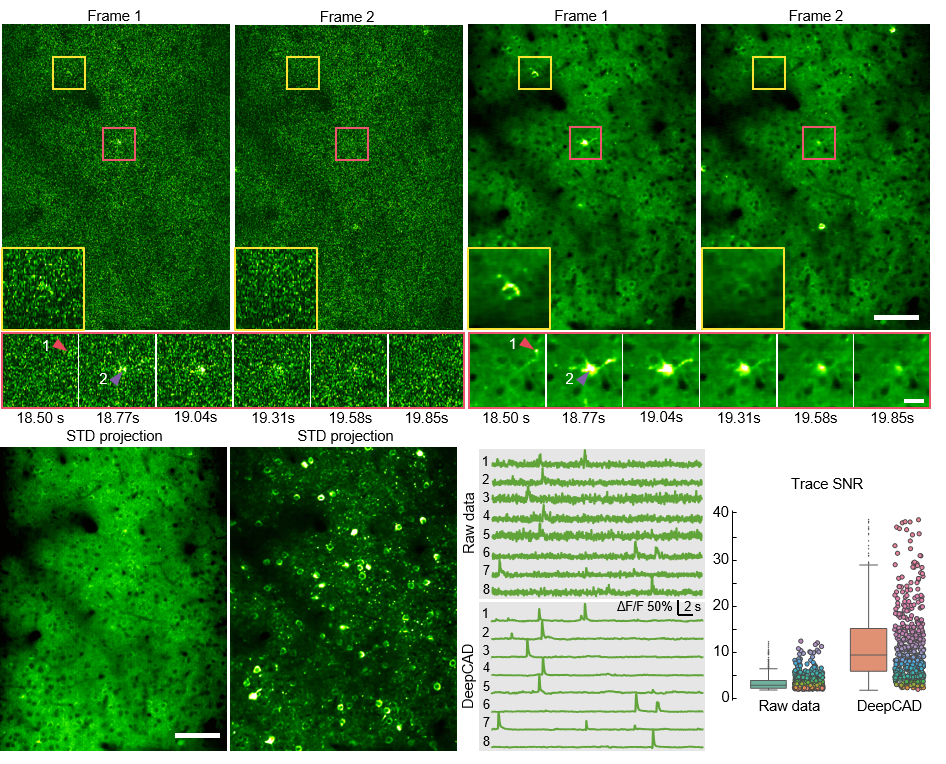

# DeepCAD: 


# Contents

- [Overview](#overview)
- [Directory structure](#directory-structure)
- [Getting started](#getting-started)
- [Fiji plugin](#fiji-plugin)
- [Results](#results)
- [License](./LICENSE)
- [Citation](#citation)

# Overview


DeepCAD model aims at denoising dynamic calcium imaging data, after which it becomes easier to extract calcium signals and neuronal contours. DeepCAD is an unsupervised deep learning model mainly based on 3D U-net and noise2noise method. Thus it is user-friendly without time-consuming process of preparing training datasets.

DeepCAD model aims at denoising dynamic calcium imaging data, after which it becomes easier to extract calcium signals and neuronal contours. DeepCAD is an unsupervised deep learning model mainly based on 3D U-net and noise2noise method. Thus it is user-friendly without time-consuming process of preparing training datasets.

DeepCAD model aims at denoising dynamic calcium imaging data, after which it becomes easier to extract calcium signals and neuronal contours. DeepCAD is an unsupervised deep learning model mainly based on 3D U-net and noise2noise method. Thus it is user-friendly without time-consuming process of preparing training datasets.

# Directory structure

The file structure is shown below:

DeepCAD_pytorch consists of the deep neural network implemented by Pytorch(https://pytorch.org/) and the data processing code implemented by Matlab(https://www.mathworks.com/products/matlab.html). DeepCAD_Fiji intents on realizing a easily operated Fiji plugin. DeepCAD_Fiji_plugin contains the executable jar file which can be installed on Fiji. DeepCAD_java is java source code of DeepCAD Fiji plugin. DeepCAD_tensorflow is the neural network executed by Tensorflow(https://www.tensorflow.org/) for generating pre-trained model.

```
DeepCAD
|---DeepCAD_pytorch
|---|---train.py
|---|---test.py
|---|---script.py
|---|---network.py
|---|---model_3DUnet.py
|---|---data_process.py
|---|---buildingblocks.py
|---|---utils.py
|---|---datasets
|---|---|---qwd_7 #project_name#
|---|---|---|---train_raw.tif #raw data for train#
|---|---pth
|---|---|---qwd_7_20200605-0913
|---|---|---|--- #pth model#
|---|---results
|---|---|--- #Results of training process and final test#
|---DeepCAD_Fiji
|---|---DeepCAD_Fiji_plugin
|---|---|---DeepCAD-0.1.0 #executable jar file/.jar#
|---|---DeepCAD_java
|---|---|--- #java source code of DeepCAD Fiji plugin#
|---|---DeepCAD_tensorflow #for create denoising model#
|---|---|---basic_ops.py
|---|---|---train.py
|---|---|---network.py
|---|---|---script.py
|---|---|---test_pb.py
|---|---|---data_process.py
|---|---|---datasets
|---|---|---|---qwd_7 #project_name#
|---|---|---|---|---train_raw.tif #raw data for train#
|---|---|---DeepCAD_model
|---|---|---|---qwd_7_20200605-0913
|---|---|---|---|--- #pth model#
|---|---|---results
|---|---|---|---#Results of training process and final test#
```

# Getting Started
## Environment 

* ubuntu 16.0 + python 3.6.2 + Pytorch 1.3.1+ Tensorflow 1.4.0
* NATLAB
* NVIDIA GPU + cuda

## Build the environment (Tensorflow)

Open the terminal of ubuntu system.

* Install python 

```
$ apt-get install python 3.6
```

* Build anaconda environment

```
$ conda create -n tensorflow python=3.6
```

* Install Tensorflow

```
$ source activate tensorflow
$ conda install tensorflow-gpu=1.4
```

* Install Pytorch

```
$ conda create -n pytorch python=3.6
$ source activate pytorch
$ pip install torch=1.3.1 torchvision
```

* Install necessary packages

```
$ pip install scipy=0.18.1
$ pip install numpy=1.16.2
......
```

## Pytorch code

#### Training

Run the script.py(training part) to begin your train.

```
$ source activate pytorch
$ os.system('python train.py --datasets_folder qwd_7 --img_h 64 --img_w 64 --img_s 464 --gap_h 64 --gap_w 64 --gap_s 500 --n_epochs 30 --GPU 3 --normalize_factor 1')
```

Parameters can be modified correctly.

```
$ os.system('python train.py --datasets_folder #project name# --img_h #stack height# --img_w #stack width# --img_s #stack length# --gap_h #stack gap height# --gap_w #stack gap width# --gap_s #stack gap length# --n_epochs #training epoch number# --GPU #GPU index# --normalize_factor #image normalizefactor#')
```

#### Test

Run the script.py (test part) to begin your test. Parameters saved in the .yaml file will be automatically loaded.

```
$ source activate pytorch
$ os.system('python test.py --denoise_model test_20201001-0003')
```

Parameters can be modified  as required.

```
$ os.system('python test.py --denoise_model #pth model name#')
```

# Fiji plugin

## Install Fiji plugin

Download the executable jar file. Install the plugin via Fiji > Plugin > Install.

## Develop a pre-trained model

First you should train a DeepCAD model based on the Tensorflow code.

```
$ source activate tensorflow
$ python main.py --GPU 3 --img_h 64 --img_w 64 --img_s 320 --train_epochs 30 --datasets_folder 3
```

Parameters can be modified as required.

```
$ python main.py --GPU #GPU index# --img_h #stack height# --img_w #stack width# --img_s #stack length# --train_epochs #training epoch number# --datasets_folder #project name#
```

The pre-trained model is saved at DeepCAD_Fiji/DeepCAD_tensorflow/DeepCAD_model/. 

## Use Fiji plugin

1.  Open Fiji.

2.  Open the calcium imaging stack to be denoised.

3.  Open the plugin at **Plugins > DeepCAD**.

4.  Select the pre-trained model and set six parameters on the panel (with default values and no changes are required unless necessary).

5.  Click ‘OK’ and the denoised result will be displayed in another window after several minutes (depends on your data size).

# Results




# Citation

If you use this code please cite the companion paper where original methods appeared: 

["*Unsupervised content-preserving transformation for optical microscopy*".](https://www.biorxiv.org/content/10.1101/848077v1.abstract)
