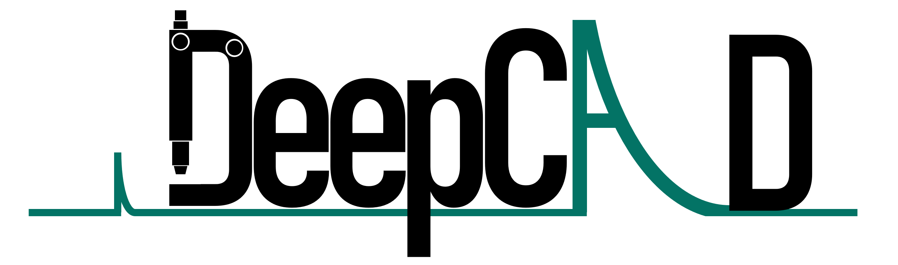
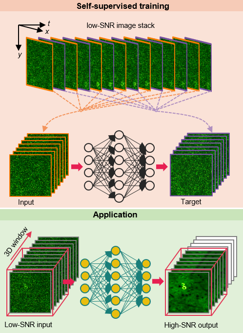
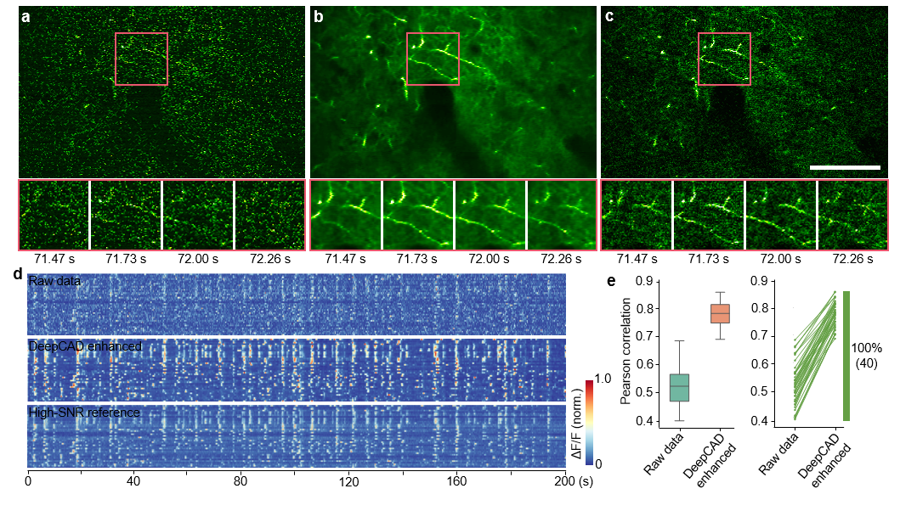
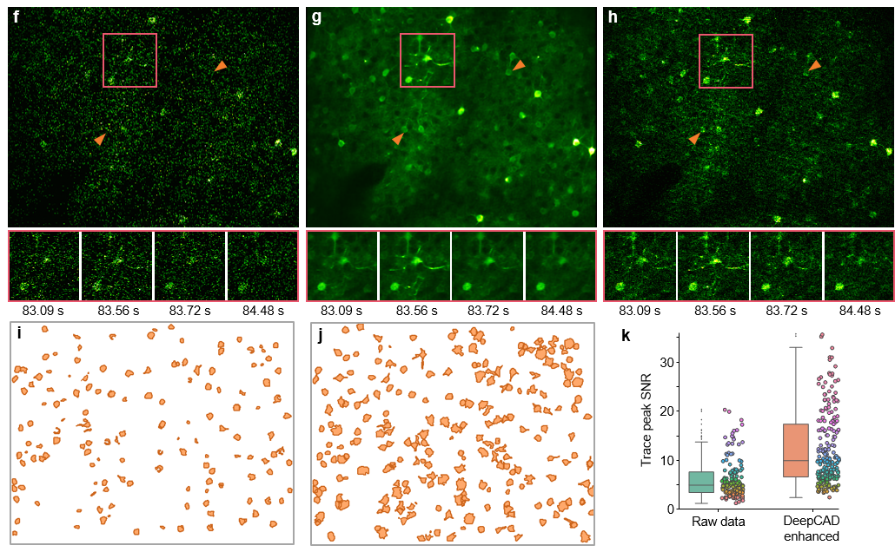
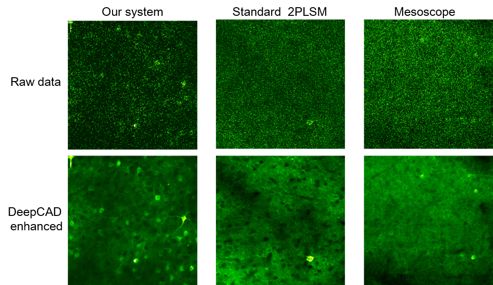

# DeepCAD: Deep self-supervised learning for calcium imaging denoising



## Contents

- [Overview](#overview)
- [Directory structure](#directory-structure)
- [Pytorch code](#pytorch-code)
- [Fiji plugin](#fiji-plugin)
- [Results](#results)
- [License](./LICENSE)
- [Citation](#citation)

## Overview



Calcium imaging is inherently susceptible to detection noise especially when imaging with high frame rate or under low excitation dosage. However, calcium transients are highly dynamic, non-repetitive activities and a firing pattern cannot be captured twice. Clean images for supervised training of deep neural networks are not accessible. Here, we present DeepCAD, a **deep** self-supervised learning-based method for **ca**lcium imaging **d**enoising. Using our method, detection noise can be effectively removed and the accuracy of neuron extraction and spike inference can be highly improved.

DeepCAD is based on the insight that a deep learning network for image denoising can achieve satisfactory convergence even the target image used for training is another corrupted sampling of the same scene [[paper link]](https://arxiv.org/abs/1803.04189). We explored the temporal redundancy of calcium imaging and found that any two consecutive frames can be regarded as two independent samplings of the same underlying firing pattern. A single low-SNR stack is sufficient to be a complete training set for DeepCAD. Furthermore, to boost its performance on 3D temporal stacks, the input and output data are designed to be 3D volumes rather than 2D frames to fully incorporate the abundant information along time axis.

For more details, please see the companion paper where the method first appeared: 
["*Reinforcing neuron extraction and spike inference in calcium imaging using deep self-supervised denoising*".](https://www.nature.com/articles/s41592-021-01225-0)

## Directory structure

```
DeepCAD
|---DeepCAD_pytorch #Pytorch implementation of DeepCAD#
|---|---train.py
|---|---test.py
|---|---script.py
|---|---network.py
|---|---model_3DUnet.py
|---|---data_process.py
|---|---buildingblocks.py
|---|---utils.py
|---|---datasets
|---|---|---DataForPytorch #project_name#
|---|---|---|---data.tif
|---|---pth
|---|---|---ModelForPytorch
|---|---|---|---model.pth
|---|---results
|---|---|--- # Intermediate and final results#
|---DeepCAD_Fiji
|---|---DeepCAD_Fiji_plugin
|---|---|---DeepCAD-0.3.0 #executable jar file/.jar#
|---|---DeepCAD_java #java source code of DeepCAD Fiji plugin#
|---|---DeepCAD_tensorflow #Tensorflow implementation compatible with Fiji plugin#
```
- **DeepCAD_pytorch** is the [Pytorch](https://pytorch.org/) implementation of DeepCAD.
- **DeepCAD_Fiji** is a user-friendly [Fiji](https://imagej.net/Fiji) plugin. This plugin is easy to install and convenient to use. Researchers without expertise in computer science and machine learning can learn to use it in a very short time. 
  - **DeepCAD_Fiji_plugin** contains the executable .jar file that can be installed on Fiji. 
  - **DeepCAD_java** is the java source code of our Fiji plugin based on [CSBDeep](https://csbdeep.bioimagecomputing.com). 
  - **DeepCAD_tensorflow** is the [Tensorflow](https://www.tensorflow.org/) implementation of DeepCAD, which is used for training models compatible with the Fiji plugin. 

## Pytorch code

**This PyTorch code is the recommended implementation of DeepCAD.**

### Environment 

* Ubuntu 16.04 
* Python 3.6
* Pytorch >= 1.3.1
* NVIDIA GPU (24 GB Memory) + CUDA

### Environment configuration

* Create a virtual environment and install Pytorch. In the 4th step, please select the correct Pytorch version that matches your CUDA version from https://pytorch.org/get-started/previous-versions/

```
$ conda create -n deepcad python=3.6
$ source activate deepcad
$ pip install torch==1.3.1
$ conda install pytorch torchvision cudatoolkit -c pytorch 
```

* Install other dependencies

```
$ conda install -c anaconda matplotlib opencv scikit-learn scikit-image
$ conda install -c conda-forge h5py pyyaml tensorboardx tifffile
```
### Download the source code

```
$ git clone git://github.com/cabooster/DeepCAD
$ cd DeepCAD/DeepCAD_pytorch/
```

### Training

Download the demo data(.tif file) [[DataForPytorch](https://drive.google.com/drive/folders/1w9v1SrEkmvZal5LH79HloHhz6VXSPfI_)] and put it into *DeepCAD_pytorch/datasets/DataForPytorch.*.

Run the **script.py** to start training.

```
$ source activate deepcad
$ python script.py train
```

Parameters can be modified  as required in **script.py**. If your GPU is running out of memory, you can use smaller `img_h`, `img_w`, `img_s` and `gap_h`, `gap_h`, `gap_s`.

```
$ os.system('python train.py --datasets_folder --img_h --img_w --img_s --gap_h --gap_w --gap_s --n_epochs --GPU --normalize_factor --train_datasets_size --select_img_num')

@parameters
--datasets_folder: the folder containing your training data (one or more stacks)
--img_h, --img_w, --img_s: patch size in three dimensions
--gap_h, --gap_w, --gap_s: the spacing to extract training patches from the input stack(s)
--n_epochs: the number of training epochs
--GPU: specify the GPU used for training
--lr: learning rate, please use the default value
--normalize_factor: a constant for image normalization
--training_datasets_size: the number of patches you extracted for training
--select_img_num: the number of slices used for training.
```

### Test

Download our pre-trained model (.pth file and .yaml file) [[ModelForPytorch](https://drive.google.com/drive/folders/12LEFsAopTolaRyRpJtFpzOYH3tBZMGUP)] and put it into *DeepCAD_pytorch/pth/ModelForPytorch*.

Run the **script.py** to start the test process. Parameters saved in the .yaml file will be automatically loaded. If your GPU is running out of memory, you can use smaller `img_h`, `img_w`, `img_s` and `gap_h`, `gap_h`, `gap_s`.

```
$ source activate deepcad
$ python script.py test
```

Parameters can be modified  as required in **script.py**. All models in the `--denoise_model` folder will be tested and manual inspection should be made for **model screening**.

```
$ os.system('python test.py --denoise_model --datasets_folder --test_datasize')

@parameters
--denoise_model: the folder containing all the pre-trained models.
--datasets_folder: the folder containing the testing data (one or more stacks).
--test_datasize: the number of frames used for testing
--img_h, --img_w, --img_s: patch size in three dimensions
--gap_h, --gap_w, --gap_s: the spacing to extract test patches from the input stack(s)
```

## Fiji plugin

To ameliorate the difficulty of using our deep self-supervised learning-based method, we developed a user-friendly Fiji plugin, which is easy to install and convenient to use (has been tested on a Windows desktop with Intel i9 CPU and 128G RAM). Researchers without expertise in computer science and machine learning can manage it in a very short time. **Tutorials** on installing and using the plugin has been moved to [**this page**](https://github.com/cabooster/DeepCAD/tree/master/DeepCAD_Fiji).


## Results

### 1. The performance of DeepCAD on denoising two-photon calcium imaging of neurite activities.



### 2. The performance of DeepCAD on denoising two-photon calcium imaging of large neuronal populations.



### 3. Cross-system validation.



Denoising performance of DeepCAD on three two-photon laser-scanning microscopes (2PLSMs) with different system setups. **Our system** was equipped with alkali PMTs (PMT1001, Thorlabs) and a 25×/1.05 NA commercial objective (XLPLN25XWMP2, Olympus). The **standard 2PLSM** was equipped with a GaAsP PMT (H10770PA-40, Hamamatsu) and a 25×/1.05 NA commercial objective (XLPLN25XWMP2, Olympus). The **two-photon mesoscope** was equipped with a GaAsP PMT (H11706-40, Hamamatsu) and a 2.3×/0.6 NA custom objective. The same pre-trained model was used for processing these data. 

## Citation

If you use this code please cite the companion paper where the original method appeared: 

Li, X., Zhang, G., Wu, J. et al. Reinforcing neuron extraction and spike inference in calcium imaging using deep self-supervised denoising. Nat Methods (2021). [https://doi.org/10.1038/s41592-021-01225-0](https://www.nature.com/articles/s41592-021-01225-0)
