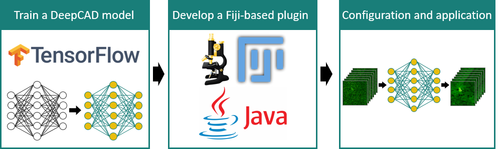
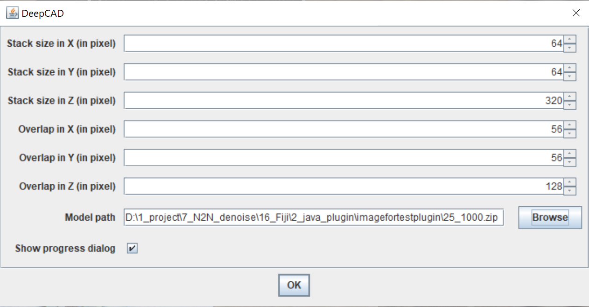

## DeepCAD: 


## Contents

- [Overview](#overview)
- [Directory structure](#directory-structure)
- [Pytorch code](#python-code)
- [Fiji plugin](#fiji-plugin)
- [Results](#results)
- [License](./LICENSE)
- [Citation](#citation)

## Overview


Calcium imaging is inherently susceptible to detection noise especially when imaging with high frame rate or under low excitation dosage. However, calcium transients are highly dynamic, non-repetitive activities and a firing pattern cannot be captured twice. Clean images for supervised training of deep neural networks are not accessible. Here, we present DeepCAD, a **deep** self-supervised learning-based method for **ca**lcium imaging **d**enoising. Using our method, detection noise can be largely removed and the accuracy of neuron extraction and spike inference is highly improved.

DeepCAD is based on the insight that a deep learning network for image denoising can achieve satisfactory convergence even the target image used for training is another corrupted sampling of the same scene [[paper link]](https://arxiv.org/abs/1803.04189). We explored the temporal redundancy of calcium imaging and found that any two consecutive frames can be regarded as two independent samplings of a same underlying firing pattern. A single low-SNR stack is sufficient to be a complete training set for DeepCAD. Furthermore, to boost its performance on 3D temporal stacks, the input and output data are designed to be 3D volumes rather than 2D frames to fully incorporate the abundant information along time axis.


For more details, please see the companion paper where the method appeared: 
["*Unsupervised content-preserving transformation for optical microscopy*".](https://www.biorxiv.org/content/10.1101/848077v1.abstract)

## Directory structure

```
DeepCAD
|---DeepCAD_pytorch
|---|---train.py
|---|---test.py
|---|---script.py
|---|---network.py
|---|---model_3DUnet.py
|---|---data_process.py
|---|---buildingblocks.py
|---|---utils.py
|---|---datasets
|---|---|---qwd_7 #project_name#
|---|---|---|---train_raw.tif #raw data for train#
|---|---pth
|---|---|---qwd_7_20200605-0913
|---|---|---|--- #pth model#
|---|---results
|---|---|--- #Results of training process and final test#
|---DeepCAD_Fiji
|---|---DeepCAD_Fiji_plugin
|---|---|---DeepCAD-0.1.0 #executable jar file/.jar#
|---|---DeepCAD_java
|---|---|--- #java source code of DeepCAD Fiji plugin#
|---|---DeepCAD_tensorflow #for create denoising model#
|---|---|---basic_ops.py
|---|---|---train.py
|---|---|---network.py
|---|---|---script.py
|---|---|---test_pb.py
|---|---|---data_process.py
|---|---|---datasets
|---|---|---|---qwd_7 #project_name#
|---|---|---|---|---train_raw.tif #raw data for train#
|---|---|---DeepCAD_model
|---|---|---|---qwd_7_20200605-0913
|---|---|---|---|--- #pth model#
|---|---|---results
|---|---|---|---#Results of training process and final test#
```
- **DeepCAD_pytorch** is the [Pytorch](https://pytorch.org/) implementation of DeepCAD.
- **DeepCAD_Fiji** is a user-friendly [Fiji](https://imagej.net/Fiji) plugin. This plugin is easy to install and convenient to use. Researchers without expertise in computer science and machine learning can learn to use it in a very short time. 
  - **DeepCAD_Fiji_plugin** contains the executable .jar file that can be installed on Fiji. 
  - **DeepCAD_java** is the java source code of our Fiji plugin based on [CSBDeep](https://csbdeep.bioimagecomputing.com). 
  - **DeepCAD_tensorflow** is the [Tensorflow](https://www.tensorflow.org/) implementation of DeepCAD, which is used for training models compatible with the Fiji plugin. 

## Pytorch code

### Environment 

* Ubuntu 16.04 
* Python 3.6
* Pytorch 1.3.1
* NVIDIA GPU + CUDA

### Environment configuration

Open the terminal of ubuntu system.

* Install Pytorch

```
$ conda create -n pytorch python=3.6
$ source activate pytorch
$ pip install torch=1.3.1 torchvision
```

* Install necessary packages

```
$ pip install scipy=0.18.1
$ pip install numpy=1.16.2
......
```

##### Training

Run the script.py(training part) to begin your train.

```
$ source activate pytorch
$ os.system('python train.py --datasets_folder DataForPytorch --lr 0.00005 \
    --img_h 64 --img_w 64 --img_s 464 --gap_h 64 --gap_w 64 --gap_s 150 --n_epochs 20 --GPU 0 --normalize_factor 1 --train_datasets_size 1200 --select_img_num 10000')
```

Parameters can be modified correctly.

```
$ os.system('python train.py --datasets_folder #project name# --img_h #stack height# --img_w #stack width# --img_s #stack length# --gap_h #stack gap height# --gap_w #stack gap width# --gap_s #stack gap length# --n_epochs #training epoch number# --GPU #GPU index# --normalize_factor #image normalizefactor# --train_datasets_size #the size of training datasets# --select_img_num #the number of images used for training#')
```

##### Test

Run the script.py (test part) to begin your test. Parameters saved in the .yaml file will be automatically loaded.

```
$ source activate pytorch
$ os.system('python test.py --denoise_model ModelForPytorch \
    --datasets_folder DataForPytorch --datasets_path datasets --pth_path pth --output_dir results --test_datasize 2000')
```

Parameters can be modified  as required.

```
$ os.system('python test.py --denoise_model #pth model name# --test_datasize #the number of images used for test#')
```

## Fiji plugin

To ameliorate the difficulty of using our deep self-supervised learning-based method, we developed a user-friendly Fiji plugin. This plugin is easy to install and convenient to use. Researchers without expertise in computer science and machine learning can learn to use it in a very short time. 



### Install Fiji plugin

Download the packaged plugin file (.jar) from *DeepCAD_Fiji/DeepCAD_Fiji_plugin*. Install the plugin via **Fiji > Plugin > Install**.

### Use Fiji plugin

1.  Open Fiji.

2.  Open the calcium imaging stack to be denoised.

3.  Open the plugin at **Plugins > DeepCAD**.

4.  Select the pre-trained model and set six parameters on the panel (with default values and no changes are required unless necessary).

5.  Click ‘OK’ and the denoised result will be displayed in another window after several minutes (depends on your data size).

### Train a customized model for your microscope

Because imaging systems and experiment conditions varies, a customized DeepCAD model trained on specified data is recommended for optimal performance. A Tensorflow implementation of DeepCAD compatible with the plugin is made publicly accessible at *DeepCAD_Fiji/DeepCAD_tensorflow*.

#### Training

```
$ source activate tensorflow
$ os.system('python main.py --GPU 0 --img_h 64 --img_w 64 --img_s 320 --train_epochs 30 --datasets_folder DataForPytorch --normalize_factor 1 --lr 0.00005 --train_datasets_size 1000')
```

Parameters can be modified as required.

```
$ python main.py --GPU #GPU index# --img_h #stack height# --img_w #stack width# --img_s #stack length# --train_epochs #training epoch number# --datasets_folder #project name#
```

The pre-trained model is saved at *DeepCAD_Fiji/DeepCAD_tensorflow/DeepCAD_model/*. 

##### Test

Run the script.py (test part) to begin your test. Parameters saved in the .yaml file will be automatically loaded.

```
$ source activate pytorch
$ os.system('python test_pb.py --GPU 3 --denoise_model ModelForTestPlugin \
    --datasets_folder DataForPytorch --model_name 25_1000 --test_datasize 500')
```

Parameters can be modified  as required.

```
$ os.system('python test.py --denoise_model #model name# --test_datasize #the number of images used for test#')
```

## Results

- **The performance of DeepCAD on denoising two-photon calcium imaging of neuropil activities of a GCaMP6f mouse.**


- **The performance of DeepCAD on denoising two-photon calcium imaging of large neuronal populations.**


- **Cross-system validation.**


## Citation

If you use this code please cite the companion paper where the original method appeared: 

["*Unsupervised content-preserving transformation for optical microscopy*".](https://www.biorxiv.org/content/10.1101/848077v1.abstract)
